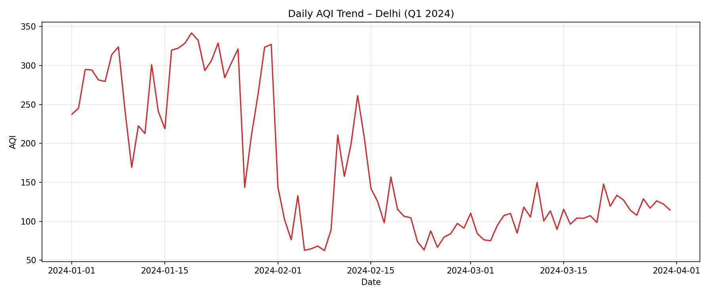
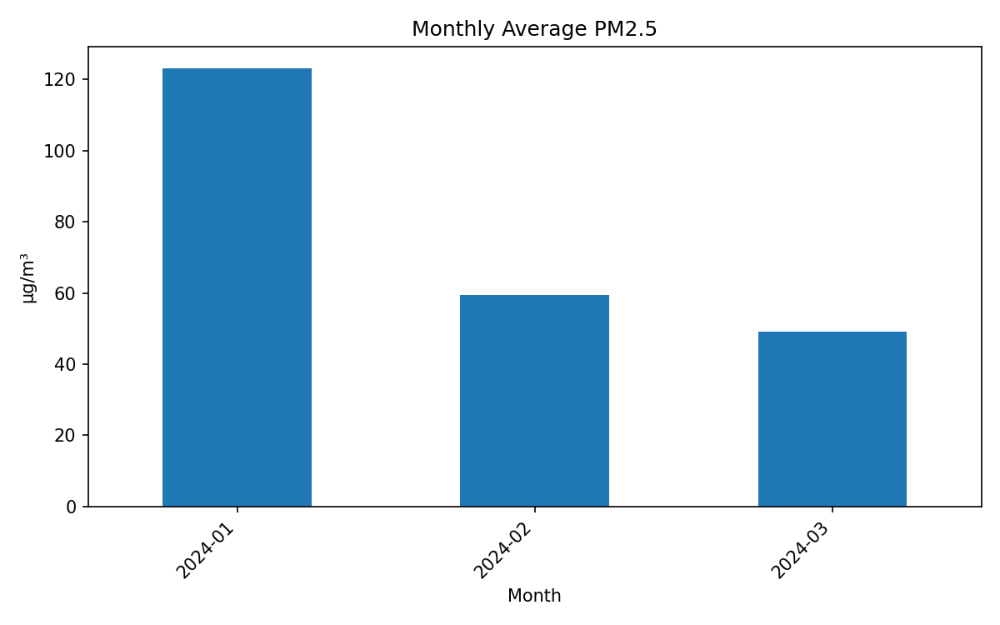
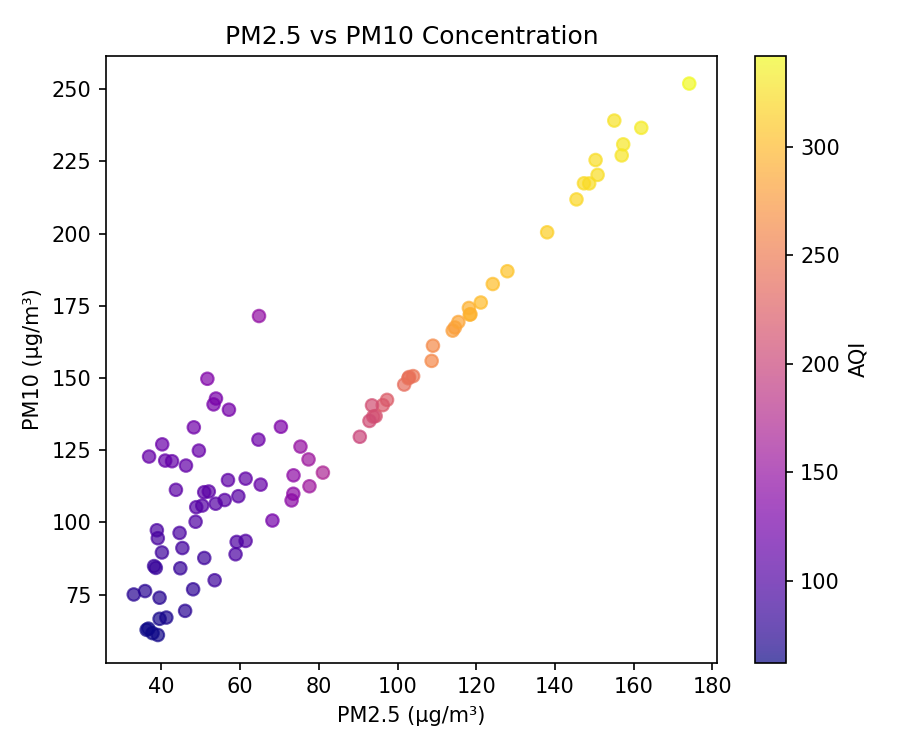
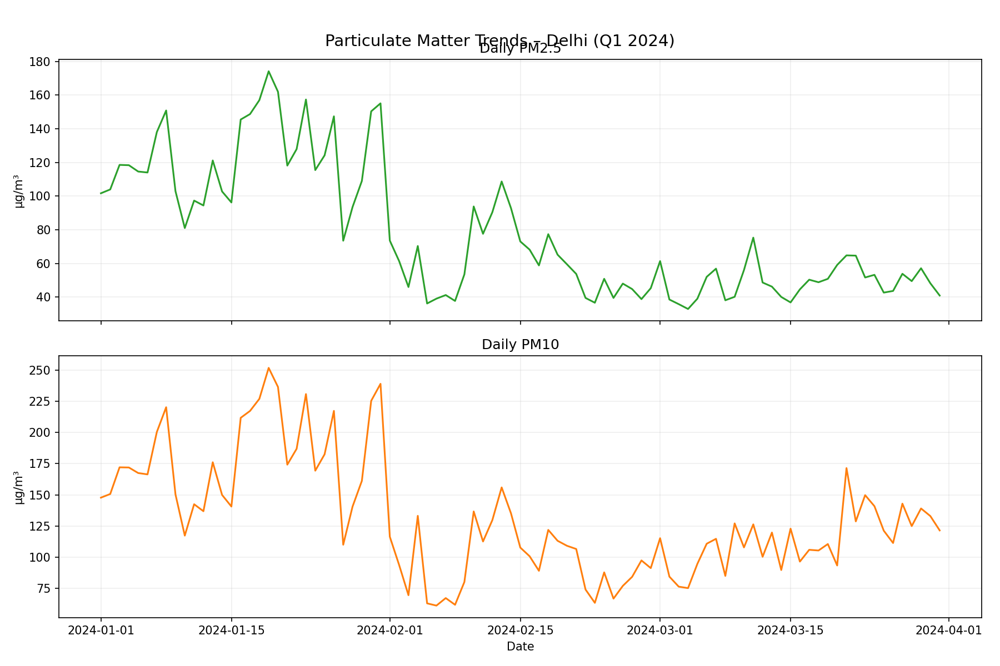

# Air Quality Data Visualizer

Mini project for *Problem Solving with Python – Unit 4*. It downloads real-world pollution data for Delhi, cleans it with Pandas/NumPy, computes AQI statistics, and exports analysis-ready tables and visualizations that can be submitted via LMS or pushed to GitHub.

## Features
- Automated data acquisition from the [Open-Meteo Air Quality API](https://open-meteo.com/).
- Daily aggregation, CPCB-style AQI computation, and identification of best/worst pollution days.
- Required Matplotlib charts (daily AQI trend, monthly PM2.5 bar, PM2.5 vs PM10 scatter, comparative subplot).
- Exported artifacts ready for submission:
  - `cleaned_air_quality.csv`
  - Summary tables in `reports/`
  - PNG plots in `plots/`
  - Narrative analysis in `report.md`

## Project Structure
```
.
├── src/air_quality_pipeline.py   # Main script
├── data/
│   ├── raw/open_meteo_delhi_q1_2024_hourly.csv
│   └── processed/                # reserved for extensions
├── plots/                        # generated PNGs
├── reports/                      # CSV summaries + metrics JSON
├── cleaned_air_quality.csv       # day-level dataset for LMS
├── README.md
└── report.md
```

## Setup
1. **Python 3.12+** recommended.
2. Install dependencies:
   ```bash
   python -m pip install --user -r requirements.txt
   ```

## Usage
Run the pipeline to refresh data, statistics, and figures:
```bash
python src/air_quality_pipeline.py
```
The script will:
- Pull hourly concentrations for Delhi (Jan–Mar 2024)
- Generate `cleaned_air_quality.csv`
- Write summary tables to `reports/`
- Save all charts to `plots/`

## Visualizations
Embed these images directly in Moodle/GitHub to showcase the results (paths are relative, so they render on GitHub automatically after you push the repo):









## Notebooks or Scripts
Only the Python script is required, but you may copy the logic into a Jupyter notebook if your course format demands it.

## Dataset
- Source: **Open-Meteo Air Quality API** (latitude 28.6139, longitude 77.2090)
- Variables: PM2.5, PM10, NO₂, SO₂, CO, AQI (US EPA reference) for 1 Jan – 31 Mar 2024.
- License: Free/open usage as per Open-Meteo terms. Cite https://open-meteo.com/ when redistributing.

## Reporting
See `report.md` for the written analysis required by the assignment (Introduction, Methodology, Graphs & Observations, Key Findings, Conclusion).

## Next Steps / Customization
- Change `START_DATE`, `END_DATE`, `LATITUDE`, or `LONGITUDE` in `src/air_quality_pipeline.py` to analyze other periods or cities.
- Extend `reports/metrics.json` with additional KPIs (e.g., exceedance counts, rolling averages).
- Embed the generated PNGs directly inside your LMS submission or README for richer storytelling.

